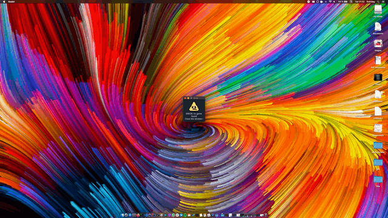

# Bad Window

## Download
You can download binaries for this game for the most common desktop platforms.
All executable are 64-Bit.

**NOTE**: On macOS and Windows the Operating System will warn you, this is
because the binaries are not signed. (Because that const money, which as a
student I cannot afford.)

[Windows Download](https://github.com/flofriday/Bad-Window/files/4048668/Bad.Window-Windows.zip)
[macOS Download](https://github.com/flofriday/Bad-Window/files/4048670/Bad.Window-macOS.zip)
[Linux Download](https://github.com/flofriday/Bad-Window/files/4048672/Bad.Window-Linux.x86_64.zip)

## Build it locally 
The game was created with Godot which you can get from [godotengine.org](https://godotengine.org)

One you donwloaded all the code from this repository, you can open the folder
with Godot and start hacking around.

